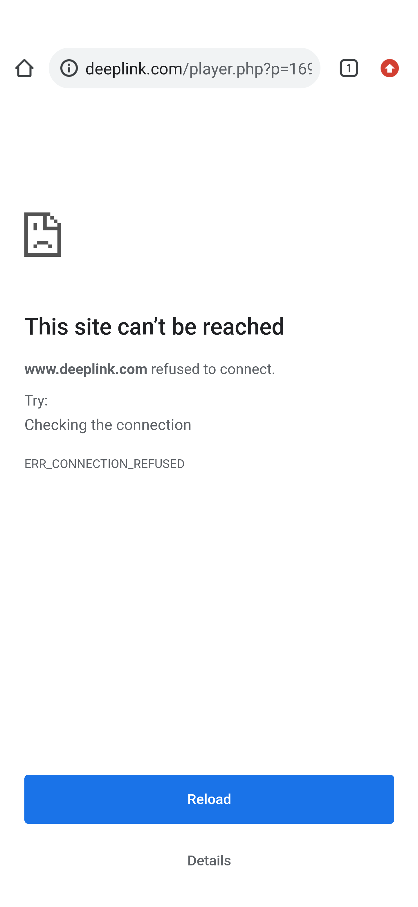

#

*   Issue 11684

    *   Deeplinking on Android causes crash #11684

        *   https://github.com/dotnet/maui/issues/11684


I was not able to reproduce.

Command

```
adb \
    shell am start \
        -W \
        -a android.intent.action.VIEW \
        -d "https://www.deeplink.com/player.php?p=16927"
```

Output

```
Starting: Intent { act=android.intent.action.VIEW dat=https://www.deeplink.com/... }
Status: ok
LaunchState: UNKNOWN (0)
Activity: com.android.chrome/org.chromium.chrome.browser.document.ChromeLauncherActivity
WaitTime: 1074
Complete
```

Result

```
www.deeplink.com refused to connect
```



